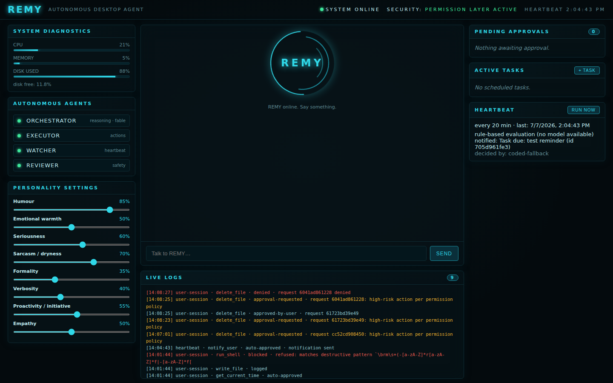

# REMY

**REMY** is a local-first, autonomous, cross-platform (Windows + macOS) desktop
AI agent — a JARVIS-style resident system with real memory, real desktop
control, and real (permission-gated) decision-making authority. Built on the
voice + MCP foundation of the FRIDAY demo, extended into a production-grade
autonomous agent.



## What REMY can do

- **Converse** by text (HUD dashboard) or voice (optional LiveKit pipeline) —
  as REMY, with a persistent identity and an adjustable personality.
- **Act autonomously**: a heartbeat loop wakes REMY every N minutes with no
  user input; it checks standing orders, due tasks, and system health, then
  *decides* (LLM or coded fallback) whether to act, notify, or just log
  "nothing to do".
- **Control the desktop**: files, shell, apps, screen capture, input
  automation — every call passes a **code-enforced permission layer**.
- **Remember**: durable facts in `MEMORY.md` (always in the system prompt) +
  a semantic vector store (Chroma, keyword fallback) for episodic recall.
- **Stay accountable**: an append-only audit log records every tool call —
  who asked, what tier, what was decided, what happened. No autonomous action
  without a log entry; if the log can't be written, REMY halts (fail closed).

## Architecture

```
Desktop shell (Tauri) — window, tray, always-on
  └─ Dashboard UI (chat · personality dials · approvals · audit · heartbeat)
       └─ FastAPI (localhost only)
            ├─ Orchestrator (Claude Fable 5) ── delegates ──┐
            ├─ Executor (Sonnet, bounded tool loop) ◄───────┘
            ├─ Watcher (cheap model / coded fallback — runs the heartbeat)
            ├─ Reviewer (conservative advisory gate)
            └─ MCP tool layer (FastMCP, SSE :8000)
                 └─ Permission engine (tiers · denylist · allowlist · approvals)
                      └─ Audit log (append-only JSONL)
```

Identity lives in real files, injected into every system prompt:
`remy/identity/IDENTITY.md`, `RULES.md`, `MEMORY.md`, `STANDING_ORDERS.md`.

## Personality settings

Every trait is a **0–100% dial**, adjustable live from the dashboard sliders,
by asking REMY ("set your humour to 80%"), or via `POST /api/personality`:

humour · emotional warmth · seriousness · sarcasm/dryness · formality ·
verbosity · proactivity · empathy

Settings persist across restarts and apply from the next reply. Dials shape
expression only — they can never loosen RULES.md or the permission tiers.

## Permission tiers (enforced in code, not prompts)

| Tier | Examples | Behaviour |
|---|---|---|
| auto | read file, screenshot, news, time | runs immediately, audited |
| logged | write in workspace, open app, read-only shell | runs, always audited |
| requires-approval | delete/move files, state-changing shell, input automation, anything outside the workspace | blocks until you approve on the dashboard; times out to **denied** |

Hard denylist (`rm -rf`, disk formatting, `sudo`, pipe-to-shell, fork bombs…)
is refused outright — approval cannot override it. Unknown tools fail closed.
Everything binds to `127.0.0.1` unless you explicitly change `REMY_BIND_HOST`.

## Quick start

```bash
git clone https://github.com/hirthik-shanmugam/remy-.git && cd remy-
pip install -e ".[llm,memory,desktop,browser]"   # add [voice] for the LiveKit pipeline
cp .env.example .env                     # set ANTHROPIC_API_KEY etc.

# Build the chat UI once (React + TypeScript + Vite + Tailwind)
cd frontend && npm ci && npm run build && cd ..

python -m remy.api        # chat UI + API + heartbeat + agents → http://127.0.0.1:8377
python server.py          # (optional) MCP server for the voice agent, :8000
python agent_remy.py dev  # (optional) LiveKit voice agent
```

`http://127.0.0.1:8377/` serves the **React chat UI**; the advanced HUD
dashboard (personality dials, audit log, approvals, heartbeat) lives at
`/hud`. During UI development, `cd frontend && npm run dev` runs Vite on
:5173 with a proxy to the backend.

Or run it as a proper desktop app (window + tray, always-on):
see [desktop/README.md](desktop/README.md).

Without an `ANTHROPIC_API_KEY`, REMY still runs: dashboard, permission layer,
audit log, scheduler, and a rule-based heartbeat all work; chat and the
LLM-judgment layers come online when a key is added. Point
`REMY_WATCHER_MODEL=ollama:<model>` at a local Ollama for free heartbeats.

## Layout

```
server.py               MCP server entry (localhost, SSE)
agent_remy.py           optional LiveKit voice agent
remy/
  identity/             IDENTITY.md · RULES.md · MEMORY.md · STANDING_ORDERS.md + loader
  personality.py        0–100% expression dials, persisted + prompt-injected
  permissions/          tiers · engine (allowlist/denylist/approvals) · audit
  tools/                web · system · utils · filesystem · shell · apps ·
                        input · screen · scheduler · memory · personality
  agents/               orchestrator · executor · watcher · reviewer · toolbox
  heartbeat.py          autonomy loop (APScheduler)
  standing_orders.py    coded condition → action → escalation engine
  memory/               MEMORY.md core + Chroma/keyword episodic store
  api.py                localhost FastAPI + dashboard host
desktop/                Tauri shell (window, tray) + HUD UI
tests/                  pytest suite (permissions, personality, autonomy)
```

## License

Apache-2.0 (see LICENSE).
